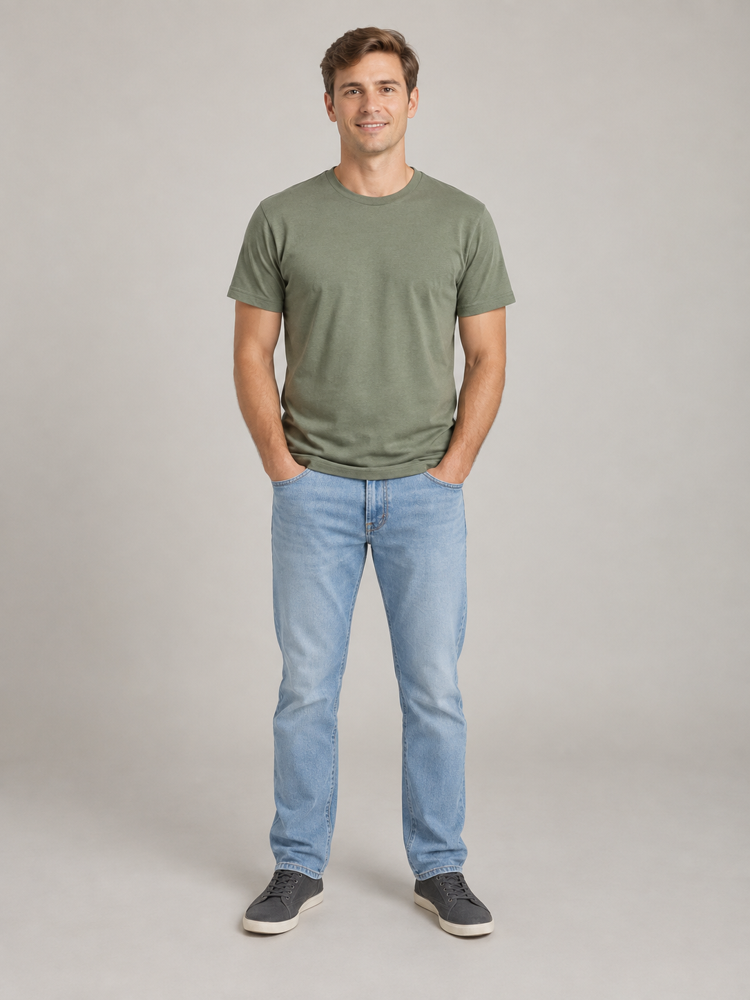
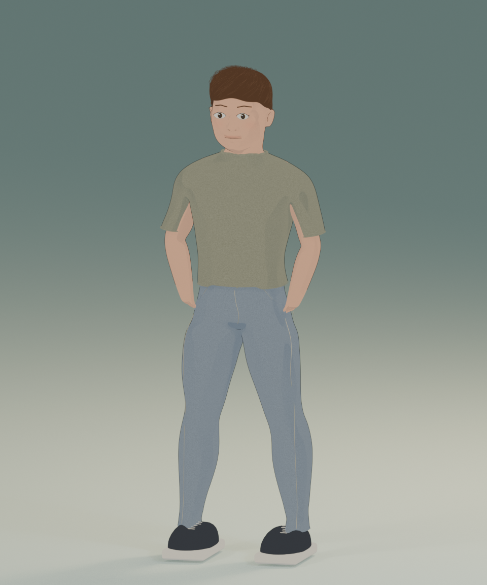

# Example: your first storybook character

This worked example uses a **fictional, AI-generated input portrait** and the released `photo-to-storybook==1.0.1` package. The output preview is a render of the generated 3D model.

| Input portrait | Generated Blender character |
| --- | --- |
|  |  |

[Download the complete example, including `.blend` and `.glb`](https://github.com/binaydhakal/photo-to-storybook/releases/download/v1.0.1/first-character-example.zip)

## Run it yourself

Install Blender 4.2 or later, then run these commands from the repository root:

```sh
python -m pip install photo-to-storybook==1.0.1
photo-to-storybook doctor
photo-to-storybook generate \
  --image examples/first-character/input.png \
  --config examples/first-character/config.json \
  --output .generated/first-character
```

The command uses the checked-in input and configuration. It writes a new model, preview, recipe, and analysis record under `.generated/first-character/`. Repeating it creates numbered outputs rather than replacing files.

If Blender is not found, add `--blender "/path/to/blender"` to the generate command or set `BLENDER_BIN`.

## Open the finished model

Download and extract the example ZIP, then open `first_character.blend` in Blender. Use Eevee to render its cel-shaded materials. The character's body, clothing, hair, face details, and contour meshes remain separate.

`first_character.glb` is also included for other 3D applications; it uses simpler PBR materials and does not preserve the full Blender toon shader.

To regenerate from inside the extracted ZIP folder:

```sh
photo-to-storybook generate --image input.png --config config.json --output regenerated
```

## How this example is configured

- Masculine adult body template, swept hair, no glasses, no beard, and no watch.
- A slightly larger head and eyes for the storybook look.
- Skin, hair, shirt, and trouser colors sampled from the input image.
- A fixed face box for reproducibility across platforms; no face-detector installation is needed for this example.
- A fixed seed and a 960-pixel-wide preview.

Edit [config.json](config.json) to change the hair, colors, proportions, or other options, then run the command again. Set color values to sRGB triples between 0 and 1, or keep `null` to sample the photograph.

## What the result demonstrates

This is a photo-guided template workflow. The person’s exact identity, expression, hair geometry, clothing details, and pose are not reconstructed. The comparison shows the actual capabilities of the released generator, including its approximate likeness and standard standing pose.

Tested with Blender 5.2.1 on macOS. Other Blender versions may produce small rendering differences. The public package's model-generation step works locally without API keys; the fictional input was created separately for this demonstration.

## Files and provenance

- `input.png`: fictional input photo, generated without a reference photograph.
- `config.json`: portable input settings.
- `preview.png`: actual Blender output render.
- `generation-notes.md`: image provenance and the full prompt used to create the sample input.
- `manifest.json`: version information and SHA-256 hashes for the example files and model downloads.

The downloadable archive also contains the native `.blend`, portable `.glb`, resolved recipe, and diagnostic settings. These large generated files are distributed as release assets rather than stored in Git history.

The example input and documentation are supplied under the repository's MIT license. Model base assets are derived from MakeHuman's CC0 data; see the repository license files.
